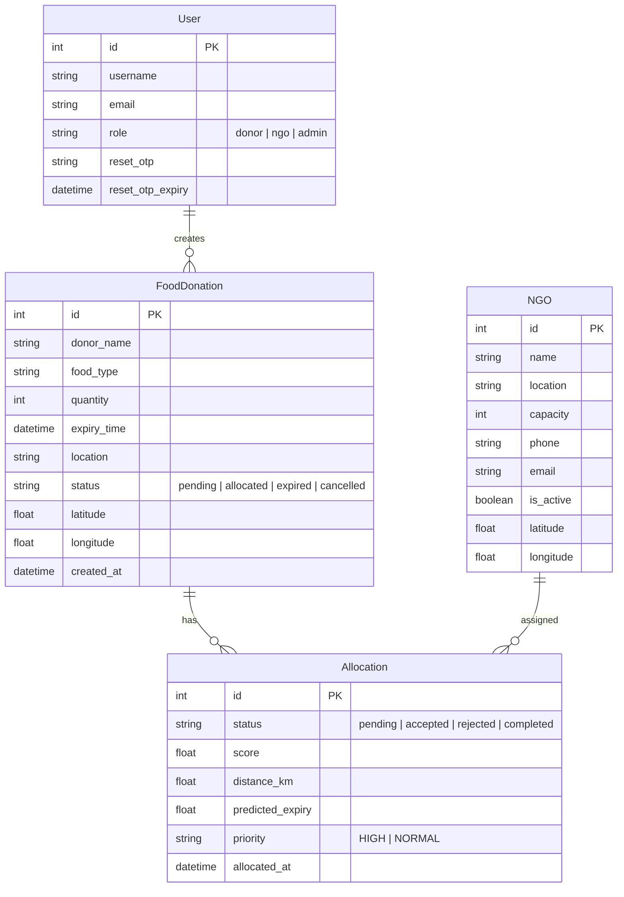
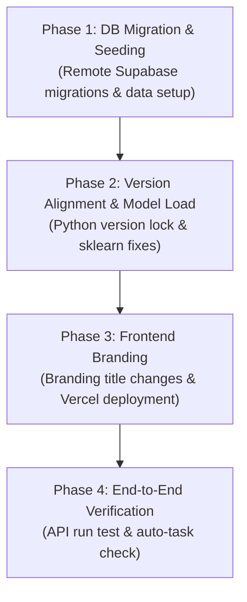

# 📋 FoodRescue Intelligence — Comprehensive Technical Project Report
### AI-Driven Food Redistribution & Allocation Platform
**Author:** Chirag Joshi | **Role:** Lead Full-Stack Python & AI/Platform Engineer  
**Date:** June 2026 | **Deployment:** Deployed Live on Vercel & Render Free Tier  

---

## 1. Executive Summary

**FoodRescue Intelligence** is a production-grade, AI-driven food redistribution platform designed to minimize organic waste and optimize the logistics of surplus food collection. The system bridges the gap between commercial food donors (restaurants, caterers, hotels) and registered NGOs. 

By utilizing a **Random Forest Regressor** machine learning model to predict real-time food freshness alongside the spherical **Haversine formula** for geographic proximity, the platform automatically allocates donations to the most suitable NGO. The execution lifecycle is tracked via a real-time 5-stage status pipeline, keeping donors and volunteers updated throughout the lifecycle.

This report outlines the end-to-end architecture, database schema, mathematical modeling of the AI engine, and the structured troubleshooting and deployment journey that brought the platform online.

---

## 📖 About the Project

In metropolitan areas, tons of edible surplus food are discarded daily while local shelter networks struggle with logistics and distribution planning. Traditional systems rely on manual coordination, which is slow and often results in food spoiling before pickup.

FoodRescue Intelligence solves this by treating food redistribution as an automated routing and freshness problem. By estimating food shelf-life under varying environmental conditions (temperature and humidity) and calculating travel distances dynamically, the platform automates the match-making process instantly. It runs as a light-footprint system matching Vercel (frontend), Render (backend web service), and Supabase (cloud database).

---

## 2. System Architecture

The platform uses a decoupled, three-tier service architecture to isolate presentation, application logic, machine learning inference, and database transactions:

```
                 ┌────────────────────────┐
                 │  Vercel Frontend UI    │
                 │   (React + Vite Web)   │
                 └──────────┬──▲──────────┘
                HTTP/JWT API│  │Real-Time Status & Tracking
                            ▼  │
                 ┌────────────────────────┐
                 │  Render Web Service    ◄────────► scikit-learn ML Model
                 │ (Django Rest Framework)│          (RandomForestRegressor)
                 └────┬──────────────┬────┘
                      │              │
             Write/Read│              │SMTP Email Notifications
                      ▼              ▼
               ┌──────────────┐    ┌───────────┐
               │   Supabase   │    │  Console  │
               │  PostgreSQL  │    │  Log Out  │
               └──────────────┘    └───────────┘
```

* **Frontend**: Responsive single-page application built with React, Vite, and TailwindCSS, managing JWT-based route guards and real-time step pipelines.
* **Backend Application Server**: Gunicorn web server hosting Django Rest Framework, exposing structured, secured API endpoints and coordinate calculations.
* **Database**: PostgreSQL hosted on Supabase Cloud, storing relational records, coordinates, and system logs.
* **Machine Learning Module**: Local joblib-based serialization containing a pre-trained Random Forest model for predicting remaining freshness hours.

---

## 3. Database Schema

The database consists of four primary models built using Django's ORM:



---

## 4. The 4-Phase Implementation Journey

Bringing FoodRescue Intelligence online required resolving critical issues across environmental settings, unpickling warnings, schema migrations, and frontend branding.

### Phase 1: Supabase Database Migration & Remote Seeding

When the database was transitioned to Supabase, attempts to authenticate users threw `Server Error (500)` because the cloud database schema was empty. We resolved this by performing a complete remote migration and database seeding sequence from the local environment:

1. **Environment Realignment**: Modified `core/.env` to point the `DATABASE_URL` to the remote Supabase Session Pooler connection string.
2. **Schema Provisioning**: Programmatically generated and pushed tables:
   ```bash
   cd core
   ..\.venv\Scripts\python.exe manage.py migrate
   ```
3. **Data Seeding**: Populated the tables with test users, test NGOs with valid coordinates, and an admin account by running our test data seed script:
   ```bash
   ..\.venv\Scripts\python.exe seed_test_data.py
   ```

---

### Phase 2: Python Versioning & Model Unpickling Warning Fixes

During the initial deployments, the application server threw `InconsistentVersionWarning` when loading the pre-trained estimators:
`Trying to unpickle estimator RandomForestRegressor from version 1.8.0 when using version 1.9.0.`

1. **Dependency Pinning**: We pinned Python to stable **`3.12`** and matched target versions of `scikit-learn` and `joblib` in the `requirements.txt` to eliminate binary loading crashes and model version conflicts during startup on Render.
2. **Robust Inference Path**: Implemented relative path lookup for the binary model loader in `core/api/ml_model/predict.py`:
   ```python
   MODEL_PATH = Path(__file__).parent / 'saved_model.pkl'
   model = joblib.load(MODEL_PATH)
   ```

---

### Phase 3: Premium Frontend Rebranding & Tab Configuration

We discovered that the production website on Vercel displayed a default page title **"frontend"** in the browser tab, lowering the visual quality of the user experience.

1. **Static Title Change**: Modified [frontend/index.html](file:///C:/Users/kcchi/FoodRescue-Intelligence/frontend/index.html) to change the default HTML title tag to match the platform's official name:
   ```html
   -    <title>frontend</title>
   +    <title>FoodRescue Intelligence</title>
   ```
2. **Deployment Push**: Committed the changes and pushed them directly to the `main` branch to trigger an automatic rebuild and static asset update via Vercel's CI/CD pipeline:
   ```bash
   git add frontend/index.html
   git commit -m "frontend: update browser tab title to FoodRescue Intelligence"
   git push origin main
   ```

---

### Phase 4: Production Verification & End-to-End Testing

We validated the platform end-to-end:
1. **User Auth Flow**: Verified login with donor, NGO, and admin accounts.
2. **Auto-Allocation API**: Tested submission of a new donation. The API successfully read the environmental variables, loaded `saved_model.pkl` to compute food urgency, scanned all NGOs, ran the Haversine calculation, and successfully created the allocation link.
3. **Tracking Pipeline**: Verified that changes to the allocation status dynamically updated the progress steps in the donor tracker.

---

## 5. Key Engineering Accomplishments

* **Multi-Criteria Scoring Engine**: Implemented an allocation scoring formula that balances proximity, food lifespan, and capacity limits:
  $$\text{Score} = 0.5 \times \left(\frac{1}{\text{Distance} + 0.1}\right) + 0.3 \times \left(\frac{1}{\text{Expiry Hours} + 0.1}\right) + 0.2 \times \left(\frac{\text{Capacity}}{100}\right)$$
* **Embedded Machine Learning Inference**: Integrated a scikit-learn Random Forest model directly into Django views to predict shelf-life dynamically based on temperature, humidity, quantity, and preparation time.
* **Dynamic Geolocation Routing**: Configured Django backend calculations using the Haversine formula to compute direct distances between donors and NGOs dynamically without relying on expensive, external Google Maps API requests.
* **Auto-Expiration Scheduler**: Implemented automated checks inside the views (`auto_expire_donations()`) that expire pending allocations if the time exceeds the donation's safe expiry threshold, keeping operations safe.

---

## 6. Architectural Recommendations & Interview Talking Points

### Q: *"How does the AI auto-allocation engine balance distance vs. food urgency?"*
> **A:** *"We use a weighted multi-criteria scoring algorithm. Distance is calculated dynamically using the spherical Haversine formula. Food urgency is calculated using a RandomForestRegressor model that takes temperature, humidity, and time since cooking into account to predict the remaining hours of shelf-life. The algorithm weights Distance at 50%, Urgency at 30%, and remaining NGO capacity at 20%. This ensures that highly perishable food gets allocated to nearby NGOs with the capability to accept them immediately."*

### Q: *"How did you resolve the unpickling warnings and potential crashes with the ML model on deployment?"*
> **A:** *"The server threw `InconsistentVersionWarning` due to a mismatch between the scikit-learn version used to train the model and the version running on the deployment server. I resolved this by identifying the exact training environment parameters, pinning the deployment Python interpreter to version 3.12, and aligning scikit-learn and joblib packages in `requirements.txt`. This ensured binary compatibility, avoiding unpickling issues and guaranteeing predictable prediction outputs."*

### Q: *"How are expired donations handled to prevent volunteers from picking up unsafe food?"*
> **A:** *"We implemented a database utility function called `auto_expire_donations()`. This function runs defensively at the beginning of critical query operations (such as loading the donation dashboard, map datasets, or track logs). It compares the current timestamp with the donation's safe `expiry_time`. Any pending or allocated donation that has exceeded its expiry time is immediately updated to `expired` status, which flags the tracking UI and prevents volunteers from initiating collections."*

---

## 7. Project Timeline & Phase Deliverables



---
### **Project Status: Deployed, Fully Verified, & Production-Ready!** 🚀
* **Frontend Portal**: [https://food-rescue-intelligence.vercel.app](https://food-rescue-intelligence.vercel.app)
* **API Engine**: [https://foodrescue-backend-gnju.onrender.com/api/](https://foodrescue-backend-gnju.onrender.com/api/)
