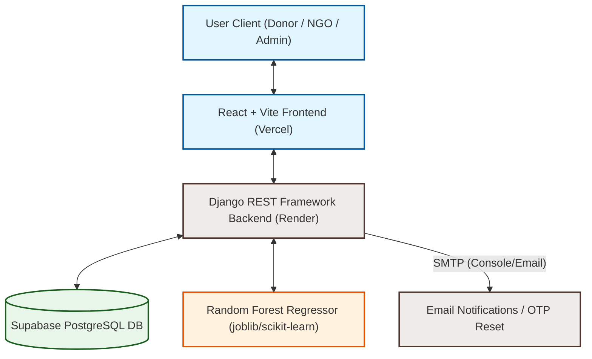
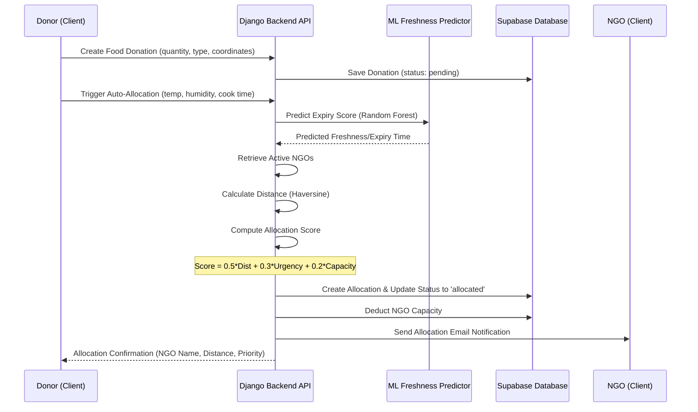

# FoodRescue Intelligence 🌱

> **AI-Powered Surplus Food Redistribution & Delivery Platform**

FoodRescue Intelligence is a production-grade, distributed workflow and web platform designed to automatically match food donors (restaurants, caterers, hotels) with local NGOs. By utilizing a **Random Forest Regressor** machine learning model to predict remaining food shelf-life under variable ambient conditions alongside the **Haversine formula** for geographic routing, the platform optimizes pickup urgency, manages NGO capacities, and tracks deliveries in real time.

---

## 🚀 Key Features

* **🤖 Smart AI Matching Engine**: Evaluates proximity, food freshness (predicted via ML), and NGO capacity to calculate a real-time allocation score.
* **🚚 Real-time Status Pipeline**: Features a visual 5-stage delivery pipeline tracking:
  `Donation Submitted 🍱` ➔ `AI Matched 🤖` ➔ `NGO Accepted ✅` ➔ `In Progress 🚚` ➔ `Delivered! 🎉`
* **🕒 Automatic Expiry Tasks**: Scans database entries and flags expired donations automatically to prevent pickup of unsafe food.
* **🔑 Role-Based Access Control**: Separate dashboards and permission sets for **Donors** (create listings, trigger AI), **NGOs** (accept runs, update capacities), and **Admins** (system diagnostics).
* **✉️ Notification Dispatch**: Standard console and SMTP email alerts notify NGOs immediately upon successful AI allocation.
* **🗺️ Coordinate-Based Spatial Map**: Maps geographical distributions of donor listings and matching NGO centers.

---

## 🏛️ System Architecture

The platform uses a decoupled, three-tier service-oriented architecture:



---

## 🤖 The AI Allocation Engine

When a donor lists food, they trigger the **Auto-Allocation Algorithm**, which assigns the best destination NGO using a weighted score:



### 1. Freshness Forecasting (Machine Learning)
A local **Random Forest Regressor** predicts remaining food shelf-life (expiry hours) from ambient parameters:
- **Quantity** (units)
- **Temperature** (°C)
- **Humidity** (%)
- **Time Elapsed Since Cooking** (hours)

If the model predicts a remaining lifespan of $< 10\text{ hours}$, the donation is prioritized as **HIGH** urgency.

### 2. Geolocation Matching (Haversine Formula)
Geographic coordinates are analyzed to determine straight-line distance dynamically:
$$d = 2r \arcsin\left(\sqrt{\sin^2\left(\frac{\Delta \phi}{2}\right) + \cos(\phi_1)\cos(\phi_2)\sin^2\left(\frac{\Delta \lambda}{2}\right)}\right)$$
*Where $r = 6371\text{ km}$ (Earth's radius), $\phi$ represents latitude, and $\lambda$ represents longitude.*

### 3. Allocation Math
$$\text{Allocation Score} = 0.5 \times \text{Distance Score} + 0.3 \times \text{Urgency Score} + 0.2 \times \text{Capacity Score}$$
- **Distance Score** $= 1 / (d + 0.1)$
- **Urgency Score** $= 1 / (\text{predicted\_expiry\_hours} + 0.1)$
- **Capacity Score** $=\text{NGO Capacity} / 100$

---

## 🔑 Database Schema Models

Implemented via Django ORM and mapped to PostgreSQL:

* **User**: Extends standard user roles (`donor`, `ngo`, `admin`) and stores verification reset OTP values.
* **FoodDonation**: Holds food classification data, quantities, expiry targets, and physical coordinates.
* **NGO**: Profile data tracking contact information, capacity thresholds, and coordinates.
* **Allocation**: Links donations to matched NGOs, detailing the calculations (`score`, `distance_km`, `priority`) and state changes.

---

## 🔑 API Reference

All requests must pass standard JWT authorization headers: `Authorization: Bearer <token>` (except `/api/login/` and `/api/register/`).

| Method | Endpoint | Auth | Description |
|---|---|---|---|
| **POST** | `/api/register/` | None | Create a new donor/NGO user profile |
| **POST** | `/api/login/` | None | Authenticate credentials and retrieve JWT and user role |
| **POST** | `/api/token/refresh/` | None | Refresh an expired access token |
| **GET** | `/api/donations/` | JWT | List donations (donors see only their own listings) |
| **POST** | `/api/donations/` | Donor | Submit a new surplus food donation |
| **POST** | `/api/auto-allocate/` | Donor | Trigger the AI match-making and routing algorithm |
| **GET** | `/api/track-donation/<id>/` | JWT | Get step-by-step progress and delivery status logs |
| **GET** | `/api/ngos/` | JWT | Fetch active recipient organizations |
| **GET** | `/api/stats/` | JWT | Retrieve platform-wide metrics (waste saved, total meals) |
| **POST** | `/api/password-reset/` | None | Request OTP for verification check |
| **POST** | `/api/password-reset/confirm/`| None | Submit OTP and set new password |

---

## 🛠️ Local Development & Quick Start

### 1. Requirements
- Python `3.12`
- Node.js `18+`
- SQLite or PostgreSQL

### 2. Backend Setup
```bash
# Navigate to core
cd core

# Create and activate virtual environment
python -m venv .venv
.venv\Scripts\activate      # Windows
source .venv/bin/activate   # macOS / Linux

# Install dependencies
pip install -r requirements.txt

# Create local environment config
cp .env.example .env        # Add local DB details

# Run migrations and seed data
python manage.py migrate
python seed_test_data.py

# Launch development API server
python manage.py runserver
```
*API running at:* `http://127.0.0.1:8000/`  
*Admin console:* `http://127.0.0.1:8000/admin/`

### 3. Frontend Setup
```bash
# Navigate to frontend
cd frontend

# Install package dependencies
npm install

# Run Vite local server
npm run dev
```
*Web dashboard running at:* `http://localhost:5173/`

---

## 🌍 Production Deployments

### Backend Service (Render + Supabase)
1. Commit changes to GitHub.
2. Link the repository to Render as a **Web Service**.
3. Point database settings to your **Supabase PostgreSQL** instance pooler.
4. Set required variables (`SECRET_KEY`, `DEBUG=False`, `ALLOWED_HOSTS`, `CORS_ALLOWED_ORIGINS`).

### Frontend Service (Vercel)
1. Import the repository on Vercel.
2. Set the root directory to `frontend/`.
3. Provide the backend target URL under environment variable `VITE_API_URL`.
4. Deploy. Auto-rebuild runs on every branch push.
